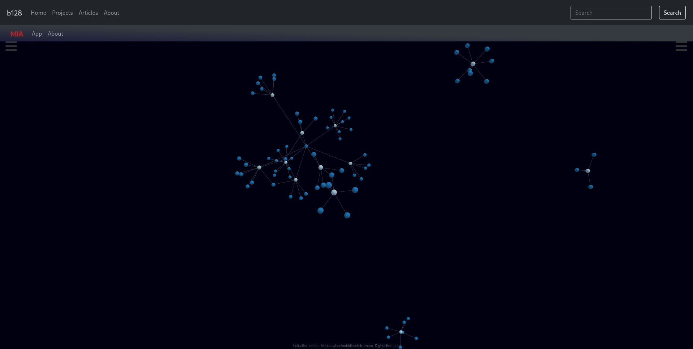

# Moderator Influence Analyzer (MIA)

## Table of Contents
- [Moderator Influence Analyzer (MIA)](#moderator-influence-analyzer-mia)
  - [Table of Contents](#table-of-contents)
  - [Concept](#concept)
  - [API](#api)
    - [Software stack](#software-stack)
  - [Database](#database)
    - [Software stack](#software-stack-1)
  - [Website](#website)
    - [Software stack](#software-stack-2)
  - [Resulting Proof of Concept](#resulting-proof-of-concept)

## Concept

This project started when I came across a post sharing this table:

Curious about the nature of moderation on Reddit, I decided to create a tool that displays this kind of information in an interactive and dynamic form.  The end result is a web app that can display a 3D graph of moderator's influence over reddit by connectiong the moderator to their subreddits.

## API

### Software stack

- Javascript
- Node.js
- PM2
- Express.js
- celebrate (validation middleware)
- Mongodb node driver

The API accepts the moderator queries, subreddit queries, and top list queries.  The queries accepting parameters verify legal input using the celebrate package.

## Database

### Software stack

- MongoDB
- Python 3
- crontabs
- praw (Reddit API driver)
- pymongo (MongoDB driver)

The database uses Python to create and update the table data.  Recurring updates are scheduled using crontabs.

## Website

Initially using react, the website now uses nextjs to host the web app.  The application is stylized using bootstrap.  Query submissions use formik, joi, and yup for parameter entry and verification.  The graph uses the react-force-graph-3d package for clean integration of data visualization.

### Software stack

- Javascript
- Typescript
- Node.js
- Bootstrap
- Formik
- Next.js
- Joi
- React.js
- Yup
- d3

## Resulting Proof of Concept

